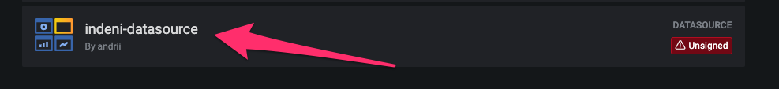
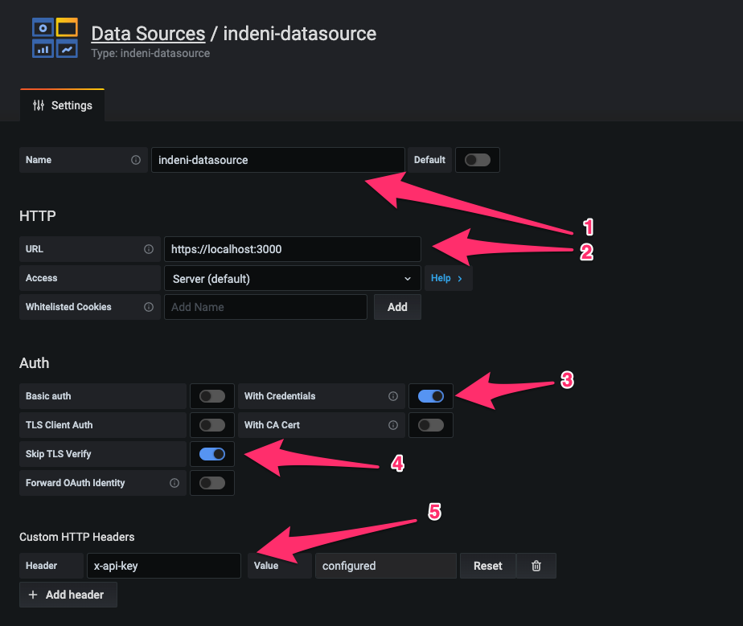
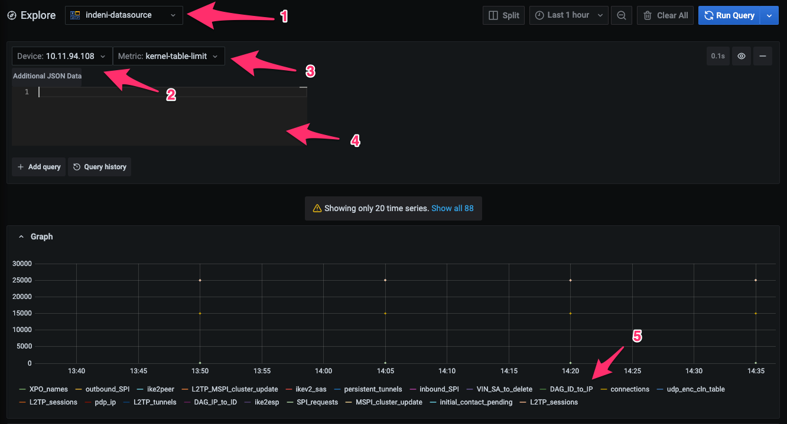

# Indeni Data Source Plugin for Grafana

## How to install

To make this plugin available in your Grafana installation you will need to:

1. Go to your Grafana folder
```
.../grafana/plugins
```
2. Create there a new folder called 'indeni-datasource'

3. Copy there the source code of this repository

4. Open a terminal window and go to the folder

5. Install dependencies

```BASH
yarn install
```

6. Build plugin in production mode
```BASH
yarn dev
```
7. Once the build is ready, you'll need to restart the Grafana (Way of restart depends on the system you are using)

```BASH
brew services restart grafana
```

8. Open Grafana and go to the 'Plugins' section. Validate that you have your new plugin in place.



## Configure the Data Source

Once you have the Indeni Data Source installed you can configure it. To configure it you'll need:



1. Go to Configuration -> Data Sources and press the 'Add data source' button.

2. Select 'indeni-datasource' from all available data sources.

3. Then specify the required settings for your new data source. You can use the image as guidance. 

* You can choose a name for your new Data Source **(1)**

* You should provide URL to the Indeni server **(2)**

* Trigger on 'With Credentials' flag to send the credentials with your request **(3)**

* Trigger on 'Skip TLS Verify' so you won't have any problems with https certificate validation **(4)**

* Add new header 'x-api-key' to get data from Indeni **(5)**. You can find the value for it in Indeni. To do so, you'll need to go to the Indeni -> Settings -> About and in the section 'Api Info' you'll see the value for that header.

4. Press the 'Save & Test' button. In the result, you should see the message 'Data source is working'.

## Use the Data Source in your charts

When you want to use the Data Source to create a new chart, you will need to:



1. Select your new data source **(1)**

2. Select desired device **(2)**

3. Select desired metric for that device **(3)**

4. Additionally, you can provide some additional JSON data to filter even more **(4)**. For example, you can use something like:
```
{ "name": "ike2esp" }
```

Potentially, for some metrics, you can get a lot of different results. Like on the screenshot you can see that we have 88 different results for one metric. In this case, we can separate them by their names **(5)**. In legend, you can see the list of all the names for possible results. If you wish to filter and leave only one metric, you can use 'Additional JSON data' and write something like
```
{ "name": "ike2esp" }
```
where **"ike2esp"** is the name of the metric.
